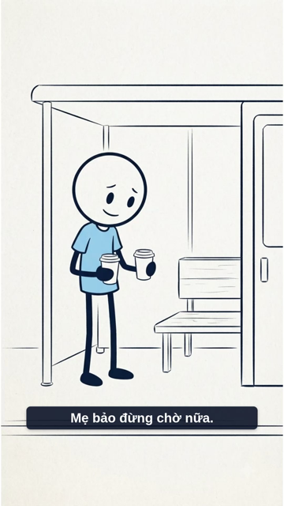
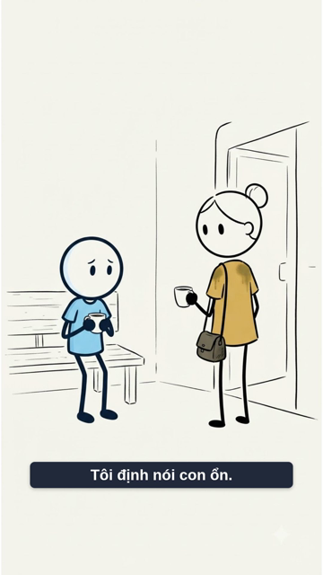

# Ly trà đã nguội — video thử revision 1

**Đã có MP4: 61.76 giây · 1080×1920 · 30 fps.** Content r3 và media r2 đã duyệt; video r1 chờ người dùng xem.

[Mở video thử](/home/hongphuoc6104/Desktop/pipelineFlow/sys/runs/vocab-wait-for-script-738/revisions/render/1/video.mp4) · [Bản duyệt video r1](/home/hongphuoc6104/Desktop/pipelineFlow/sys/runs/vocab-wait-for-script-738/reviews/video/1/review.md)

## Đã kiểm

- File có video H.264 và audio AAC; giải mã toàn bộ không báo lỗi.
- Bố cục24 cụm phụ đề đạt kiểm kỹ thuật, không tràn khung; audit nhịp không có lỗi/cảnh báo.
- Đã xem10 khung từ MP4 ở kích thước360×640, gồm đủ chín hình của câu chuyện, phần mở, điền câu/đáp án và kết.
- Giữ lượt chờ thực hành4 giây. Chữ mô hình I'm waiting for my mum. / Please wait for me. và stem Please ... me. hiển thị trong các khung đã xem.

## Giới hạn còn lại

- Từ41,20 tới46,32 giây, phụ đề dưới khung tách riêng “me.” từ câu mẫu bỏ trống. Bài tập ở vùng trên vẫn hiện trọn Please ... me., nhưng cue cuối cần chỉnh để tránh từ lẻ trong bản hoàn thiện.
- Hạn chế tham chiếu nhân vật phụ và đổi vị trí ở cảnh đưa trà đã được báo ở media r2; bản thử giữ bộ hình đó.
- Agent chưa nghe hoặc xem phát liên tục toàn bộ MP4 vì công cụ không hỗ trợ; không ghi đã đạt phát âm, diễn xuất hoặc đồng bộ từ nghe. Người dùng xem/nghe bản thật trước khi chốt video.

## Các khung hình đã xem

### 1 giây

### 6 giây

### 17 giây

### 21 giây

### 26 giây

### 31 giây

### 39 giây

### 44 giây

### 48 giây

### 60 giây

